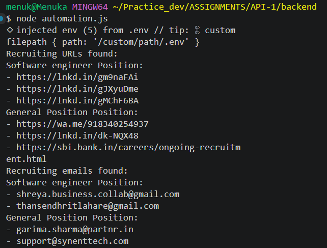
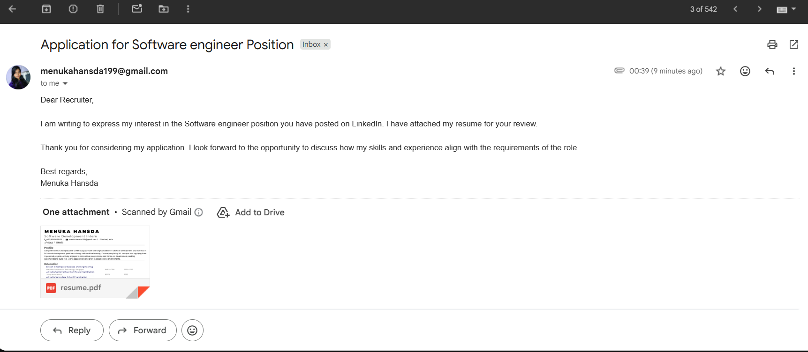
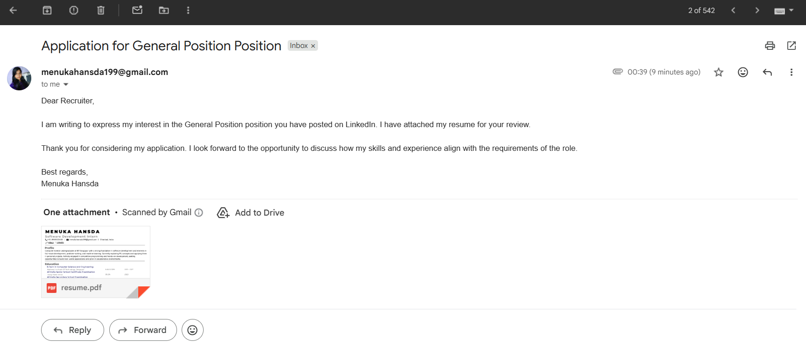

# LinkedIn Job Scrapper

## Description
This is an automation API that scrapes job postings from LinkedIn. It was built as a task/assessment project.

## Features
- Automates job search workflow using browser automation (`Playwright`)
- Scrapes jobs related to specific keywords from the feed
- Uses `Nodemailer` to authenticate with Gmail and send emails to extracted recruiter contacts with an attached resume (currently restricted to a single recipient in demo mode).

## Screenshots 
Below are sample outputs from the automation flow:



Currently the emails are only to my own gmail for demo purposes

## Installation
Clone the repository and install dependencies:

```bash
git clone https://github.com/username/linkedin-job-scrapper.git
cd backend
npm install
```

## Usage

### Note
- Uncomment line 122 (`bcc: emails`) to send emails to the extracted recruiter list.
- Before running as a CLI script, uncomment the last line (`line 238`) that calls the function.

---

### Run Automation via CLI

```bash
node automation.js
```

### Run as backend server
```bash
npm start
```

# Important Note

- Make sure `.env `file is properly configured before running
- Use responsibly to avoid LinkedIn/Gmail restrictions

## Requirements
- Node.js >= 18
- Google App Password enabled (for Gmail SMTP)

## Structure of .env file

``` bash
PORT=your port number
EMAIL = your email (gmail only)
LINKEDIN_PASSWORD = your LinkedIn password
GOOGLE_APP_PASSWORD = your google app password
RESUME_FILE_PATH = path to resume
```

